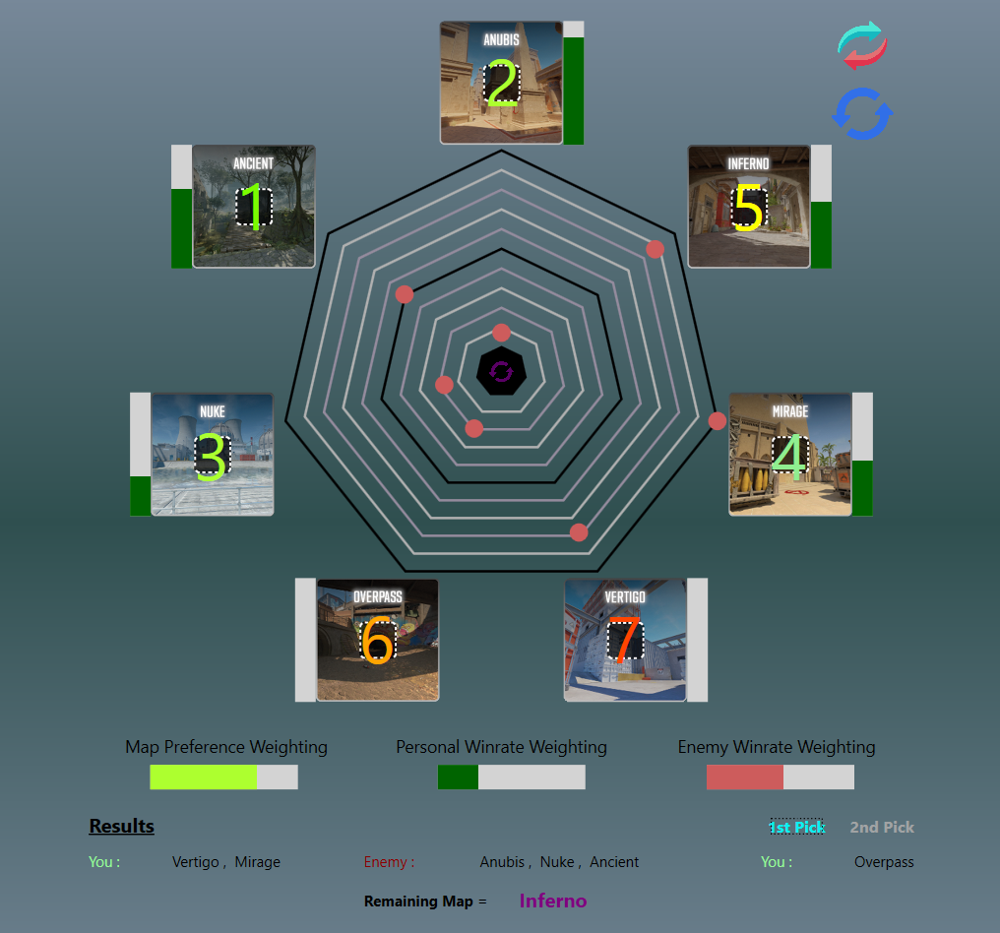

  <h1>MapBanSimulator  </h1> 

## Purpose
Simple application meant for simulating the map-banning phase according to your desired maps, winrate, and the enemy winrate in Counter Strike 2

## System Requirements
- Windows XP or later
- A brain

## Instructions
- executable provided in releases
- figure it out
- Note: this will not get you to global elite

